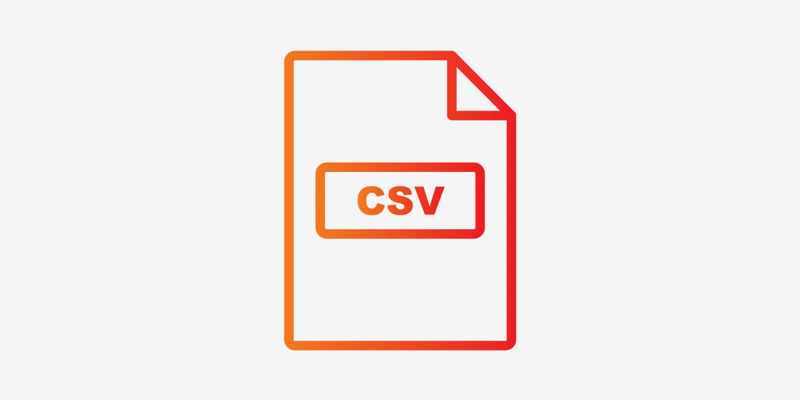

> A simple flexible SUPER FAST  and lightweight CLI to validatote CSV schemas

[](https://oclif.io)
[](https://npmjs.org/package/csvalidate)
[](https://www.npmjs.com/package/csvalidate)
[](https://github.com/vitormalencar/csvalidate/blob/master/package.json)

## Why it's awesome
Comming soon

<!-- toc -->

- [Usage](#usage)
- [Commands](#commands)
  <!-- tocstop -->

# Install

**Install globally with npm**

```sh
npm i -g csvalidate
```

**Install with npm**

```sh
npm i csvalidate
```

**Install with Yarn**

```sh
yarn global add csvalidate
```

**Run with npx (without installing)**

```sh
npx csvalidate
```

# Usage

<!-- usage -->

Run csvalidate and give a CSV file as the first argument

```sh
csvalidate data.csv
```

<!-- usagestop -->

# Commands

```sh
 Usage:

  csvalidate [PATH] [RULES]

 Options:

  -h, --help              Display help information
  -v, --version           Output csvalidate version
  -p, --path=path         Path to CSV  file
  -r, --rules=path        Path to rules file

 Examples:

  csvalidate data.csv

  csvalidate -p data.csv  -r .rules.json

  csvalidate --path data.csv --rules .rules.json

 Default settings with no arguments:

```
